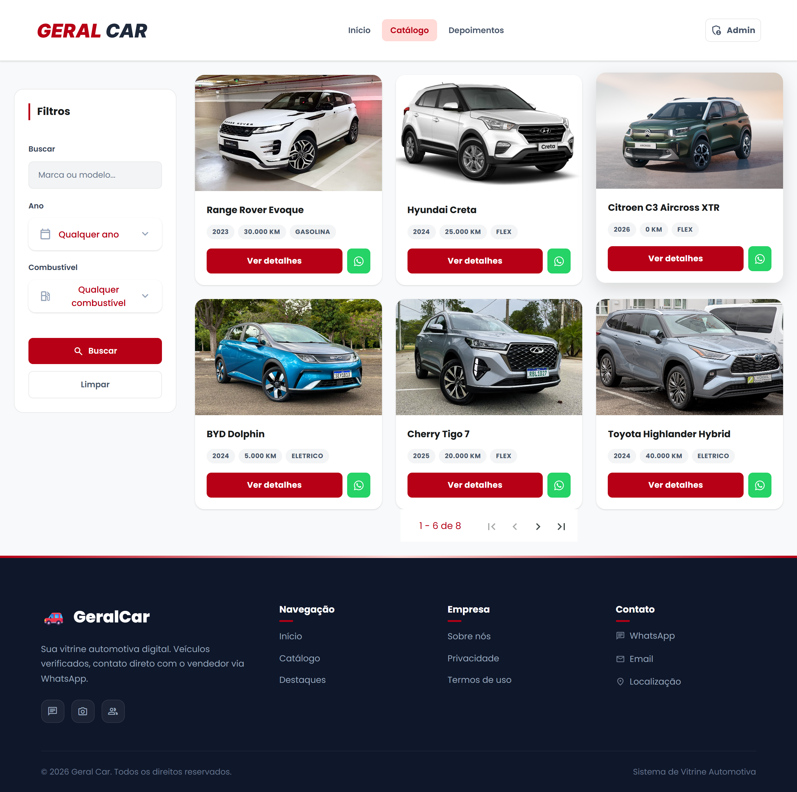
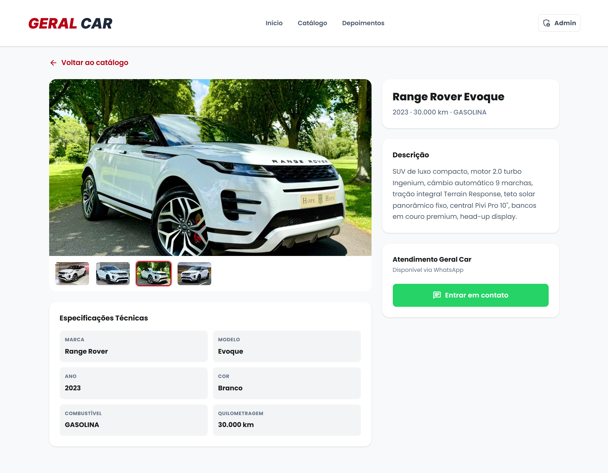
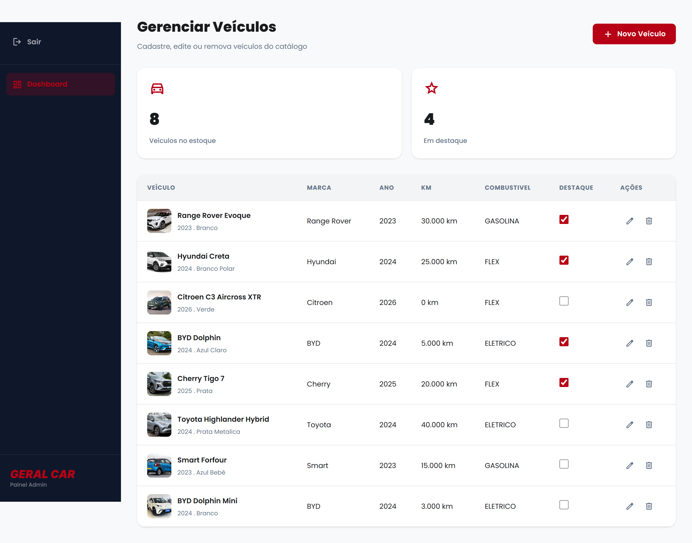

<p align="center">
  
</p>

# GeralCar App

Frontend web da plataforma **GeralCar**, desenvolvido para disponibilizar o catálogo de veículos de uma concessionária e oferecer uma interface administrativa para gerenciamento do estoque.

A aplicação foi construída com **Angular e TypeScript** e consome a [GeralCar API](https://github.com/DanielCamposSantos/geral-car-api), responsável pela persistência dos dados, autenticação, filtros, paginação e gerenciamento dos veículos e imagens.

## Sobre o projeto

O GeralCar App possui dois principais fluxos:

* **área pública**, utilizada para consultar veículos, aplicar filtros, visualizar informações detalhadas e entrar em contato com a concessionária;
* **área administrativa**, utilizada para cadastrar, editar e excluir veículos, gerenciar imagens e definir itens em destaque.

A aplicação utiliza componentes standalone do Angular, **Signals** para gerenciamento de estado compartilhado do catálogo e `HttpClient` com RxJS para comunicação assíncrona com o backend.

## Destaques técnicos

* Angular 21 com componentes standalone;
* TypeScript com tipagem estrita;
* gerenciamento de estado local com Angular Signals;
* Reactive Forms nos formulários administrativos;
* integração REST com Angular `HttpClient`;
* autenticação baseada em sessão HTTP;
* interceptor funcional para envio de credenciais;
* Angular Router para navegação e query parameters;
* Angular Material em componentes de interface;
* RxJS para tratamento dos fluxos assíncronos;
* layout responsivo com SCSS, Grid e Flexbox;
* integração direta com WhatsApp;
* comunicação com backend desenvolvido em Java e Spring Boot.

## Demonstração

Uma demonstração completa dos fluxos público e administrativo da plataforma está disponível no vídeo abaixo.

[](https://www.youtube.com/watch?v=Sot_Eb1jJeQ)

**[▶ Assistir à demonstração no YouTube](https://www.youtube.com/watch?v=Sot_Eb1jJeQ)**

O vídeo apresenta a navegação pelo catálogo, filtros, visualização dos detalhes de um veículo, autenticação administrativa e operações de gerenciamento integradas à GeralCar API.

## Interface

### Página inicial

A página inicial apresenta o acesso ao catálogo, filtros rápidos e veículos selecionados como destaque.


### Catálogo de veículos

O catálogo oferece busca textual, filtros e paginação utilizando os dados disponibilizados pela API.



### Detalhes do veículo

Cada veículo possui uma página própria com galeria de imagens, descrição, especificações técnicas e integração com WhatsApp.



### Área administrativa

A interface administrativa permite consultar o estoque e realizar operações de cadastro, edição, exclusão, gerenciamento de imagens e definição de veículos em destaque.



## Funcionalidades

### Área pública

* página inicial com acesso ao catálogo e veículos em destaque;
* catálogo paginado;
* busca textual por marca ou modelo;
* filtros por ano e tipo de combustível;
* sugestões de busca baseadas nos dados fornecidos pela API;
* estados visuais para carregamento, erro e catálogo vazio;
* cards com informações resumidas dos veículos;
* página individual de detalhes;
* galeria com múltiplas imagens;
* descrição e ficha técnica;
* contato via WhatsApp com mensagem contextualizada para o veículo selecionado;
* layout responsivo para diferentes tamanhos de tela.

### Área administrativa

* login administrativo;
* visualização geral do estoque;
* cadastro de veículos;
* edição das informações;
* exclusão de veículos;
* gerenciamento das imagens associadas;
* definição de veículos em destaque;
* validação dos formulários;
* mensagens de sucesso e erro após operações administrativas.

## Tecnologias

| Finalidade  | Tecnologias                    |
| ----------- | ------------------------------ |
| Framework   | Angular 21                     |
| Linguagem   | TypeScript                     |
| Estado      | Angular Signals                |
| Navegação   | Angular Router                 |
| Formulários | Angular Forms e Reactive Forms |
| Comunicação | Angular HttpClient e RxJS      |
| Interface   | Angular Material               |
| Estilos     | HTML e SCSS                    |

## Estrutura da aplicação

```text
geral-car-app/
├── public/
│   └── images/
├── docs/
│   └── screenshots/
├── src/
│   ├── app/
│   │   ├── components/
│   │   ├── interceptors/
│   │   ├── models/
│   │   ├── pages/
│   │   ├── services/
│   │   ├── app.config.ts
│   │   └── app.routes.ts
│   ├── environments/
│   └── styles/
├── angular.json
└── package.json
```

As principais responsabilidades estão distribuídas entre:

* **pages**: telas principais da aplicação;
* **components**: elementos reutilizáveis da interface;
* **services**: comunicação com a API e regras compartilhadas pelo frontend;
* **models**: contratos TypeScript utilizados pela aplicação;
* **interceptors**: configuração comum das requisições HTTP;
* **environments**: configuração da URL do backend.

## Principais rotas

| Rota              | Finalidade                            |
| ----------------- | ------------------------------------- |
| `/home`           | Página inicial e veículos em destaque |
| `/catalog`        | Catálogo, filtros, busca e paginação  |
| `/detalhes/:id`   | Informações completas do veículo      |
| `/login`          | Autenticação administrativa           |
| `/admin/veiculos` | Gerenciamento do estoque              |

## Integração com a API

A aplicação se comunica com a GeralCar API através do Angular `HttpClient`.

A URL-base do backend é definida através da configuração de environment:

```ts
export const environment = {
  production: false,
  API_URL: 'http://localhost:8080',
};
```

O `VeiculoService` centraliza as operações relacionadas ao catálogo e ao gerenciamento dos veículos.

Entre as operações consumidas estão:

* consulta completa do estoque;
* consulta paginada com filtros;
* consulta individual de veículo;
* consulta dos veículos em destaque;
* cadastro;
* atualização;
* exclusão;
* gerenciamento de imagens;
* alteração do estado de destaque.

O serviço de autenticação envia as credenciais para:

```text
POST /api/auth/login
```

A autenticação utilizada pela solução é baseada em **sessão HTTP**.

Um interceptor funcional configura as requisições com:

```ts
withCredentials: true
```

permitindo que o navegador envie o cookie de sessão fornecido pelo backend.

O frontend não armazena tokens de autenticação em `localStorage` ou `sessionStorage`.

A autorização das operações administrativas é validada pela GeralCar API.

## Fluxo público

1. A página inicial carrega dados do estoque e veículos em destaque.
2. O usuário pode iniciar uma pesquisa ou acessar diretamente o catálogo.
3. Busca e filtros são enviados para a API através da consulta paginada.
4. O usuário pode abrir a página individual de um veículo.
5. A página apresenta imagens, descrição e especificações.
6. O contato com a concessionária é iniciado através de um link para WhatsApp com mensagem preenchida automaticamente.

## Fluxo administrativo

1. O usuário realiza autenticação.
2. As credenciais são enviadas para a GeralCar API.
3. Após autenticação, o usuário acessa a interface administrativa.
4. O painel consulta o estoque através da API.
5. O usuário pode cadastrar, editar ou remover veículos.
6. Imagens podem ser adicionadas ou removidas individualmente.
7. Veículos podem ser marcados ou removidos da seção de destaque.

## Componentes e interface

A aplicação possui componentes reutilizáveis para elementos como:

* layout principal;
* cards de veículos;
* filtros;
* galeria de imagens;
* tabela de especificações;
* formulários;
* diálogos de confirmação;
* notificações de feedback.

A interface utiliza Angular Material em elementos específicos, mantendo estilização própria através de SCSS.

## Como executar

### Pré-requisitos

* Node.js compatível com Angular 21;
* npm;
* uma instância configurada da [GeralCar API](https://github.com/DanielCamposSantos/geral-car-api).

### Instalação

```bash
git clone https://github.com/DanielCamposSantos/geral-car-app.git
cd geral-car-app
npm ci
```

### Configuração da API

Configure o endereço do backend no environment:

```ts
export const environment = {
  production: false,
  API_URL: 'http://localhost:8080',
};
```

Durante o desenvolvimento local, o backend utiliza por padrão:

```text
http://localhost:8080
```

O backend também deve estar configurado para permitir a origem utilizada pelo frontend e o envio de credenciais.

### Desenvolvimento

```bash
npm start
```

A aplicação ficará disponível por padrão em:

```text
http://localhost:4200
```

### Build

```bash
npm run build
```

Os artefatos gerados ficam em:

```text
dist/geral-car
```

## Backend

O backend da plataforma está disponível em:

**[DanielCamposSantos/geral-car-api](https://github.com/DanielCamposSantos/geral-car-api)**

Ele é responsável por:

* autenticação e autorização;
* persistência dos veículos;
* filtros e paginação;
* gerenciamento de imagens;
* PostgreSQL;
* integração com Supabase Storage;
* testes automatizados da solução backend.

## Status

A aplicação possui atualmente os fluxos público e administrativo necessários para consumo da GeralCar API.

O projeto ainda não é apresentado neste repositório como uma aplicação publicada em ambiente de produção.

## Autor

**Daniel Campos Pinto Santos**

[GitHub — DanielCamposSantos](https://github.com/DanielCamposSantos)
